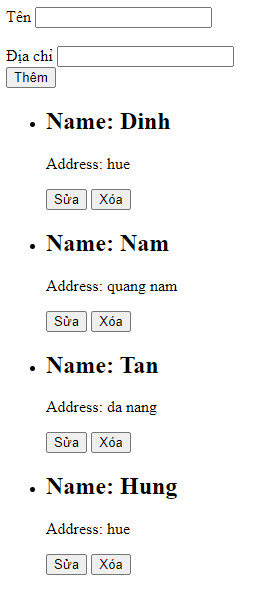

## Cho danh sách sinh viên như sau:

```js
const students = [
  {
    id: "1",
    name: "Dinh",
    address: "hue",
  },
  {
    id: "2",
    name: "Nam",
    address: "quang nam",
  },
  {
    id: "3",
    name: "Tan",
    address: "da nang",
  },
  {
    id: "4",
    name: "Hung",
    address: "hue",
  },
  {
    id: "5",
    name: "Tri",
    address: "quang tri",
  },
  {
    id: "6",
    name: "Anh",
    address: "hue",
  },
  {
    id: "7",
    name: "Binh",
    address: "da nang",
  },
];
```

1. Hiển thị danh sách sinh viên ra trình duyệt
2. Chức năng thêm 1 sinh viên
3. Chức năng sửa 1 sinh viên
4. Chức năng xóa 1 sinh viên


// const updateHandler = () => {
// const updatedName = document.getElementsByName("name")[0].value;
// const updatedAddress = document.getElementsByName("address")[0].value;
// studentToUpdate.name = updatedName;
// studentToUpdate.address = updatedAddress;
// btnUpdate.style.display = "none";
// renderListStudent();
// resetInputFields();
// btnUpdate.removeEventListener("click", updateHandler);
// };

    ///////////

const updateHandler = (studentToUpdate, btnUpdate) => {

const updatedName = document.getElementsByName("name")[0].value;
const updatedAddress = document.getElementsByName("address")[0].value;
studentToUpdate.name = updatedName;
studentToUpdate.address = updatedAddress;
btnUpdate.style.display = "none";
renderListStudent();
resetInputFields();
btnUpdate.removeEventListener("click", handleUpdate);
};
const handleUpdate = (id) => {
const studentToUpdate = students.find((student) => student.id === id);
const btnUpdate = document.getElementById("update");
updateHandler(studentToUpdate, btnUpdate);
};
const onUpdateStudent = (id) => {
const studentToUpdate = students.find((student) => student.id === id);
if (studentToUpdate) {
updateInputFields(studentToUpdate?.name, studentToUpdate?.address);
const btnUpdate = document.getElementById("update");
btnUpdate.style.display = "inline-block";
btnUpdate.addEventListener("click", handleUpdate);
}
};
